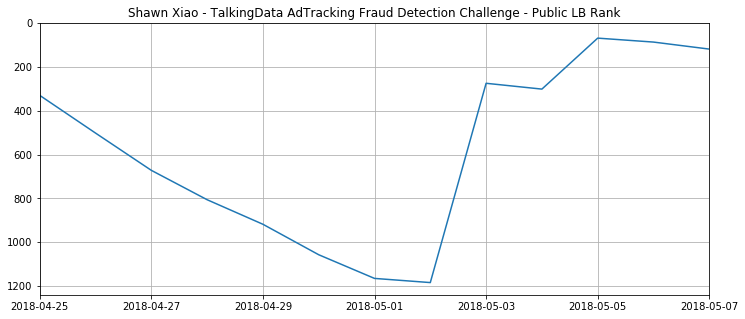

# 2018-Kaggle-AdTrackingFraud

- [English document](README.md)
- [中文文档](README-ZH.md)

[TalkingData AdTracking Fraud Detection Challenge](https://www.kaggle.com/c/talkingdata-adtracking-fraud-detection) is a data mining competition conducted by TalkingData at Kaggle. Finally, I got a **silver medal** in a **solo** job.

The journey of this competition is quite interesting for me. It should be perhaps the one which competition I spend the least time on. It was on April 25th that I discovered this competition. Then I casually downloaded the submission in other's kernel and submitted it. At that time, I was ranked over 300th+, then I put it down. When I continued doing it, it is May 2nd and I was ranked over 1100th+. From May 2nd to May 7th, I only spent about **6 days** in this competition (there are other jobs I have to finish during this period, so it is not a full-time job on this competition). Luckily, I got a silver medal finally. The figure below is the ranking change during my competition.

Because of the short time, my results are all generated from the single model LightGBM, and I have not tried other models. So I will just share two parts that I think are more important: processing of billion-level data and feature construction.

## Processing of billion-level data

The data provided by the organizers is about 10G, with more than 100 million samples. How to use limited memory to process this 10G data is very critical for this competition. I generally used the following operations:

1. When reading data using Pandas, if you do not specify the data type of each column, it will be read in the most conservative manner: use uint64 to read non-negative integers, use float64 to read floating-point numbers and integers with some null values. If you use this most conservative way to read data, the memory consumption is enormous. Therefore, **reading data using the appropriate data types uint8, uint16, uint34, float32, etc.**, can save us very much on memory resources.
2. Many variables will not be used afterwards. But if they are kept in memory, we will also consume our precious memory resources. Therefore, when a variable `a` (especially a large memory variable) is no longer used, we should **remove it from memory: `del a`**.
3. We often use a variable to refer to different objects. At this time, we will generate some objects that can no longer be referred. In theory, Python will automatically do garbage collection, but we need to trigger certain conditions. Therefore, we can **often call the function `gc.collect()`** to trigger garbage collection.
4. For categorical features, we generally perform one-hot conversions. If you do not convert, the model will treat the categorical features as ordered continuous values; If you convert, the feature dimension will become extremely large, and the memory consumption will increase and the speed of training model will be slowed down. LightGBM optimizes the categorical features and only needs to **specify the categorical features** when preparing the dataset for model.

## Feature construction

The feature construction is particularly critical for improving the effects of results. Feature construction can be decomposed into two questions: **what dataset to be used in construct features on** and **what features to be constructed**.

### 1. What dataset to be used in construct features on

At beginning, I used the `train+test` dataset to construct features, get 0.9800 on public LB, in the bronze medal position. Later I tried to use the `train+test_supplement` dataset to construct features and scores went up directly, get **0.9813 on public LB**, in the **silver medal** position! Therefore, from this phenomenon we can notice that the bias of the model trained from the `train+test` is much larger than the `train+test_supplement`.

### 2. What features to be constructed

1. Group by `[ip, app, channel, device, os]`, calculate next time delta
2. Group by `[ip, os, device]`, calculate next time delta
3. Group by `[ip, os, device, app]`, calculate next time delta
4. Group by `[ip, channel]`, calculate previous time delta
5. Group by `[ip, os]`, calculate previous time delta
6. Group by `[ip]`, unique count of `channel`
7. Group by `[ip, device, os]`, unique count of `app`
8. Group by `[ip, day]`, unique count of `hour`
9. Group by `[ip]`, unique count of `app`
10. Group by `[ip, app]`, unique count of `os`
11. Group by `[ip]`, unique count of `device`
12. Group by `[app]`, unique count of `channel`
13. Group by `[ip]`, cumcount of `os`
14. Group by `[ip, device, os]`, cumcount of `app`
15. Group by `[ip, day, hour]`, count
16. Group by `[ip, app]`, count
17. Group by `[ip, app, os]`, count
18. Group by `[ip, app, os]`, variance of `day`
19. Group by different combination, calculate CVR (I didn't try it because of short time. Somebody said it could improve 0.0005 score)

## Hey!

If you have any ideas, such as finding bugs in a certain place, thinking that I am incorrect or impenetrable about a method or having more creative ideas, please feel free to send an issue, pull request or discuss it directly with me! In addition, if you can star or fork this project to motivate me who has just entered the field of data mining, I will be grateful~
